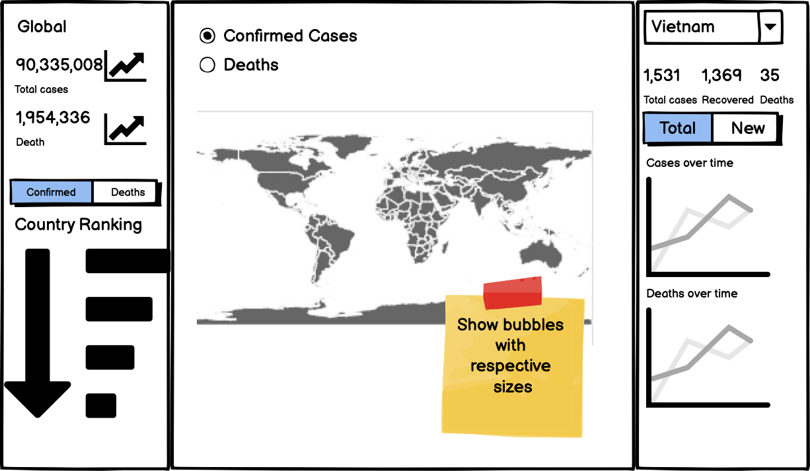

# COVID-19 Data Portal

## Authors

| Member        | Github                                            |
|---------------|---------------------------------------------------|
| Mai Le        | [lephanthuymai](https://github.com/lephanthuymai) |
| Rui Wang      | [wang-rui](https://github.com/wang-rui)           |
| Sang Yoon Lee | [rissangs](https://github.com/rissangs)           |

## Description

The COVID-19 Data Portal aims to provide the user with an interactive interface to check their number of cases in the world in a straightforward way. When opening the app, the total confirmed cases by region are shown in the center of the app in the form of a map. The user can choose to zoom in the map and check the detailed case information for a specific region.

On the left side of the dashboard, the user can view the world cases trend for recovered cases, death cases, and confirmed cases. There's also an ordered ranking on the left side which shows how many cases up till now for each countries in different categories. The user can select the categories such as confirmed cases, death cases, recovered cases from the drop-down menu.

On the right side of the dashboard, the country level statistics can be seen in both number format and trend-line format. By default, the user will see Canada's (based on locale) statistics when opening the dashboard. Users can also opt for other region's statistics by selecting from the drop-down menu to view both the case summary and the trend line.

## Dashboard Design



## Usage

Access dashboard at [TBD]

### Build the dashboard locally

**Step 1: Clone this repository**

**Step 2:**

Create and activate a conda environment using the env.yaml at the root of this project by running the following command at the root directory of the project. (Alternatively, you can manually install the dependencies listed in the env.yaml file)

```bash
conda env create --file env.yaml
conda activate covid_dash
```

Go to the root folder of the repo and execute `python src/python/app.py`

## License

The COVID-19 Data Portal materials here are licensed under the Creative Commons Attribution 2.5 Canada License (CC BY 2.5 CA). If re-using/re-mixing please provide attribution and link to this webpage.

## References

-   COVID-19 Data Repository by the Center for Systems Science and Engineering (CSSE) at Johns Hopkins University, contributors: Johns Hopkins University. <https://github.com/CSSEGISandData/COVID-19>
