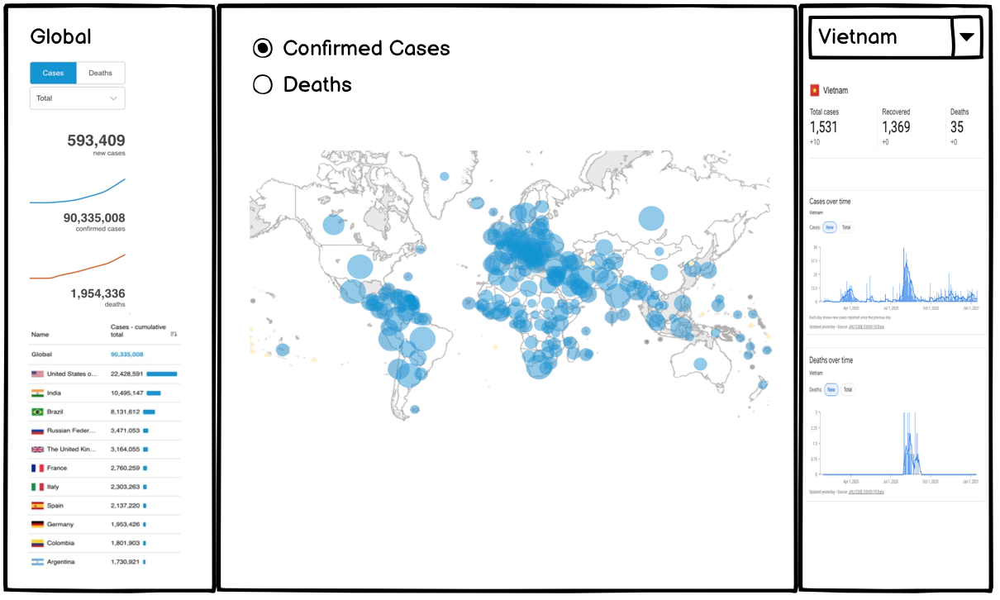

# COVID-19 Case Dashboard

The COVID-19 case dashboard provides the user with an intercative interface to check their number of cases in the world in a straightforward way. When opening the app, the total confirmed cases by region are shown in the centre of the app in the form of a map.  The user can choose to zoom in the map and check the detailed case information for a specific region. 

On the left side of the dashboard, the user can view the world cases trend for recovered cases, death cases, and confirmed cases. There's also an ordered ranking on the right side which shows how many cases up till now for each countries in different categories. The user can select the categories such as confirmed cases, death cases, recovered cases from the drop-down menu. 

On the right side of the dashboard, the country level statistics can be seen in both number format and trendline format. By default, the user will see Canada's(based on locale) statistics when opening the dashboard. Users can also opt for other region's statistics by selecting from the drop-down menu to view both the case summary and the trend line. 

